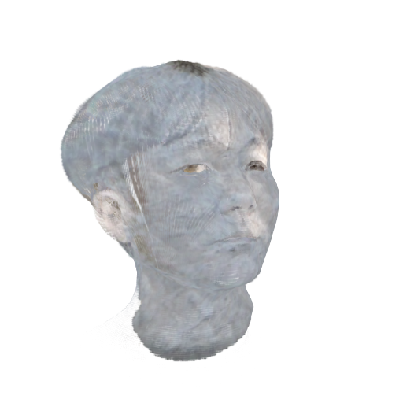

# ASURA: Awesome, Stylized, Unified, Realistic Avatars

This repository contains the ASURA project, developed as part of the CS479 course.

<p align="center">
    
</p>

## Table of contents

- [Test environment](#test-environment)
- [Data preparation](#data-preparation)
- [Data preprocessing](#data-preprocessing)
  - [Installation](#installation)
    - [MICA](#mica)
    - [metrical-tracker](#metrical-tracker)
    - [INSTA](#insta)
  - [Preprocessing](#preprocessing)
    - [MICA](#mica-1)
    - [metrical-tracker](#metrical-tracker-1)
    - [INSTA](#insta-1)
- [Head avatar reconstruction & stylization](#head-avatar-reconstruction--stylization)
  - [Installation](#installation-1)
    - [fast_neural_style](#fast_neural_style)
    - [FateAvatar](#fateavatar)
  - [Training](#training)
    - [fast_neural_style](#fast_neural_style-1)
    - [FateAvatar](#fateavatar-1)
  - [Export](#export)
    - [FateAvatar](#fateavatar-2)

## Environment

We conducted development and testing on an NVIDIA A40 GPU with CUDA toolkit version 11.6.

## Data preparation
We use a total of seven assets per subject as input to the ASURA project: three images, three videos, and one stylization image. The `data` directory should be placed in the root directory of the project as follows:
```
CS479-ASURA
|-- FateAvatar
|-- INSTA
|-- MICA
|-- README.md
|-- assets
|-- data    <-- here
|-- data.sh
|-- examples
`-- metrical-tracker
```
```
data
|-- stj
|   |-- stj.png
|   `-- video.mp4
|-- style-image
|   `-- mount-original.png
|-- sys
|   |-- sys.png
|   `-- video.mp4
`-- ysh
    |-- video.mp4
    `-- ysh.png
```

## Data preprocessing
We provide a processed dataset [here](https://drive.google.com/drive/folders/1yh09-bKQhnmLCKCq4KMMCvBD3eKyCQdB?usp=sharing). If you use this dataset, you can skip this section.
### Installation

#### MICA
Please refer to [this repository](https://github.com/ysshwan147/MICA?tab=readme-ov-file#installation). Please create an account at the [FLAME website](https://flame.is.tue.mpg.de/). You will be asked to provide `{flame_user}` and `{flame_password}` for your FLAME account in order to access the file server when you run the `install.sh` script.
```
cd MICA
./install.sh
cd ..

apt install libgl1-mesa-glx
```

#### metrical-tracker
Please refer to [this repository](https://github.com/ysshwan147/metrical-tracker#installation). Please create an account at the [FLAME website](https://flame.is.tue.mpg.de/). You will be asked to provide `{flame_user}` and `{flame_password}` for your FLAME account in order to access the file server when you run the `install.sh` script.
```
cd metrical-tracker
./install.sh
cd ..
```

#### INSTA
Please refer to [this repository](https://github.com/ysshwan147/INSTA?tab=readme-ov-file#dataset-generation).
```
cd INSTA/scripts
./install.sh
cd ../..
```

### Preprocessing
We created three conda environment(`MICA`, `tracker`, `rta`) in the previous step. You can simply run the `data.sh` script to execute the following commands. When running the script, make sure to modify the absolute path of the parameters in the `generate.sh` script under the INSTA section.
#### MICA
Please refer to [this repository](https://github.com/ysshwan147/MICA?tab=readme-ov-file#how-to-use).
```
cp ./data/{subject}/{subject}.png ./MICA/demo/input/{subject}.png

cd MICA
conda activate MICA
python demo.py
conda deactivate
cd ..
```
#### metrical-tracker
Please refer to [this repository](https://github.com/ysshwan147/metrical-tracker?tab=readme-ov-file#usage).
```
mkdir ./metrical-tracker/input/{subject}
cp ./MICA/demo/output/{subject}/identity.npy ./metrical-tracker/input/{subject}/identity.npy
cp ./data/{subject}/video.mp4 ./metrical-tracker/input/{subject}/video.mp4

cd metrical-tracker
conda activate tracker
python tracker.py --cfg ./configs/actors/{subject}.yml
cd ..
```
#### INSTA
Please refer to [this repository](https://github.com/ysshwan147/INSTA?tab=readme-ov-file#dataset-generation). When running the `generate.sh` script, use absolute paths for the tracker input and output directories.
```
cd INSTA/scripts
conda activate rta
./generate.sh /root/CS479-ASURA/metrical-tracker/output/{subject} /root/CS479-ASURA/INSTA/data/{subject} 40
conda deactivate
cd ../..
```

## Head avatar reconstruction & stylization
### Installation
#### fast_neural_style
Please refer to [this repository](https://github.com/ysshwan147/examples/tree/main/fast_neural_style).
```
cd examples/fast_neural_style
conda create -n style python=3.10
conda activate style
pip install -r requirements.txt
conda deactivate
cd ../..
```
To train the neural style model, download the COCO dataset used in this project. We also provide the COCO dataset [here](https://drive.google.com/drive/folders/1yh09-bKQhnmLCKCq4KMMCvBD3eKyCQdB?usp=sharing).
```
mkdir data
cd data
wget http://images.cocodataset.org/zips/train2014.zip
unzip train2014.zip
cd ..
```

#### FateAvatar
Please refer to [this repository](https://github.com/ysshwan147/FateAvatar/tree/ASURA?tab=readme-ov-file#installation).
```
cd FateAvatar
conda env create -f environment.yml
conda activate FateAvatar

cd submodules
pip install ./diff-gaussian-rasterization
pip install ./simple-knn
cd ..

git clone https://github.com/facebookresearch/pytorch3d.git
cd pytorch3d && pip install .
cd ..

apt install cmake -y
pip install dlib

cd submodules/3DDFA_V2
bash build.sh
cd ../..

cd submodules/nvdiffrast
pip install .
cd ../..

conda deactivate
cd ..
```
Download the following weights into the `FateAvatar/weights` directory:
  | Model                        | Links                                                        |
  | ---------------------------- | ------------------------------------------------------------ |
  | FLAME2020                    | [generic_model.pkl](https://flame.is.tue.mpg.de/)            |
  | SphereHead                   | [spherehead-ckpt-025000.pkl](https://cuhko365-my.sharepoint.com/:u:/g/personal/223010106_link_cuhk_edu_cn/EUU4STpe1p5HhLKIYgxuN6YBWNxVKac0WCXzoDLSJPn4RA?e=pOyGkK) |
  | GFPGAN1.3                    | [GFPGANv1.3.pth](https://github.com/TencentARC/GFPGAN/releases/download/v1.3.0/GFPGANv1.3.pth) |
  | VGG16 for Perpetual Loss     | [vgg16.pt](https://nvlabs-fi-cdn.nvidia.com/stylegan2-ada-pytorch/pretrained/metrics/vgg16.pt) |
  | Landmark Detection from Dlib | [shape_predictor_68_face_landmarks.dat](https://github.com/italojs/facial-landmarks-recognition/blob/master/shape_predictor_68_face_landmarks.dat) |
  | MODNet                       | [modnet_webcam_portrait_matting.ckpt](https://drive.google.com/drive/folders/1umYmlCulvIFNaqPjwod1SayFmSRHziyR) |
  | Face Parsing                 | [79999_iter.pth](https://drive.google.com/file/d/154JgKpzCPW82qINcVieuPH3fZ2e0P812/view?usp=drive_open) |
  | Parsing Net                  | [parsing_parsenet.pth](https://github.com/sczhou/CodeFormer/releases/download/v0.1.0/parsing_parsenet.pth) |


### Training
#### fast_neural_style
Please refer to [this repository](https://github.com/ysshwan147/examples/tree/main/fast_neural_style).
```
cp ./data/style/mount-original.png ./examples/fast_neural_style/images/style-images/mount-original.png

cd examples/fast_neural_style
conda activate style
python crop.py --input_path ./images/style-images/mount-original.png --output_path ./images/style-images/mount.png --pad_ratio 0.07

bash run.sh
cp ./weights/*.model ./weights/mount.model

conda deactivate
cd ../..
```
#### FateAvatar
Please refer to [this repository](https://github.com/ysshwan147/FateAvatar/tree/ASURA?tab=readme-ov-file#usage).
```
cp ./examples/fast_neural_style/weights/mount.model ./FateAvatar/edit_assets/style_transfer/mount.model

mkdir ./FateAvatar/data/insta
cp -r ./INSTA/data/{subject} ./FateAvatar/data/insta/{subject}

cd FateAvatar
conda activate FateAvatar

bash run.sh {subject}
```
### Export
#### FateAvatar
```
bash ply_export.sh {subject}
```

## Result
The final output `.ply` files can be found [here](https://drive.google.com/drive/folders/1yh09-bKQhnmLCKCq4KMMCvBD3eKyCQdB?usp=drive_link).


## Acknowledgement

This project was developed as part of the CS479 course at KAIST.  
We gratefully acknowledge the authors of the following open-source repositories for their contributions, which this project builds upon:

- [MICA](https://github.com/Zielon/MICA)
- [metrical-tracker](https://github.com/Zielon/metrical-tracker)
- [INSTA](https://github.com/Zielon/INSTA)  
- [pytorch/examples - fast_neural_style](https://github.com/pytorch/examples/tree/main/fast_neural_style)
- [FateAvatar](https://github.com/zjwfufu/FateAvatar)

Thank all the authors for their great work.
